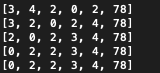

# Bubbly-Sort-Ruby

It is a solution to the bubble sort task as part of the Microverse and Odin Curriculum. The task requires participants to create a bubble sort algorithm with Ruby.

# What it does

Uses a bubble sort algorithm to sort figures in an array.

## Screenshot

## Built With

- Ruby

## Getting Started
You may use the following steps to get a local copy:

Clone project to your local machine
cd to the project directory
Open project in IDE/Text Editor
Type ruby bubblesort.rb through the terminal to run the code or use the debug button in your text editor.

## 🤝 Contributing
You are welcome to make contributions to the repository. Contributions may be made through issues comments and feature requests.

## 👤 Author

# Hillary Okerio
- GitHub [here](https://github.com/hillarioh/)
- Twitter: [@hillaokri](https://twitter.com/hillaokri)

# Calvin
- GitHub [here](https://github.com/calvinoea/)
- Twitter: [@yasukeoz](https://twitter.com/yasukeoz)
- LinkedIn: [Calvin](https://www.linkedin.com/in/calvin-ebun-amu-9b200017a/)

## Show your support
Give a ⭐️ if you like this project!

## 📝 License
This project is MiT licensed.

